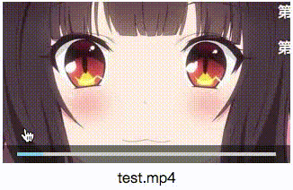

# NyarukoPreview
- 用于网站中的视频缩略图预览。
- 鼠标在缩略图中左右移动可以显示预览图片。
- 缩略图会一次生成，单张图片加载，不会加载整个视频。

## 工作流程
- 配置 `videopreconf.php` 。
- 上载视频。
- 调用 `videopre.php` 生成视频缩略图。
- 添加缩略图到网页。

## 使用说明

### 在第一次使用时
- 请编辑 `videopreconf.php` ，修改以下变量：
  - `ffmpeg`：你需要安装 `ffmpeg` ，并将此处设置为该可执行文件路径。
  - `imagemagick_convert`：你需要安装 `imagemagick` ，并将此处设置为 `convert` 可执行文件路径。
  - `deletecmd`：设置为系统删除命令路径，例如 Linux 使用 `rm -f` 。
  - `maindir`：设置为网站根目录路径，已 `/` 结尾。
  - `picnum`：截图数量，目前只支持为 10 ，不要修改。
  - `picwidth`：缩略图宽度，建议与 `.nyarukopreview` 的 CSS 宽度设定对应。
  - `picheight`：缩略图高度，建议与 `.nyarukopreview` 的 CSS 高度设定对应。
- 权限设定
  - 请将视频文件夹的权限设定为网站用户（例如 `www` 或 `iisuser` 等）可以读写。
  - 请给予 PHP 的 `exec` 权限，并允许其调用 `ffmpeg` 和 `imagemagick` 以及删除命令权限。

### 生成缩略图
- 用过网址调用 `videopre.php` 时，使用以下 GET 参数：
  - `file=*.mp4`：视频文件路径（必须）。
  - `overlay`：如果已经生成过缩略图，仍然进行覆盖生成。
- 暂不支持 PHP 方法调用，以后可能会添加。
- 生成后的文件：
  - `<视频文件名称>_p.jpg`：缩略图图册。
  - `<视频文件名称>_p.css`：缩略图图片坐标样式文件。
- 可选补充文件 `<视频文件名称>_p.json` :
  - `"danmaku":<字符串数组>`：要显示的弹幕。
- `videopre.php` 返回结果代码：

0. 成功
1. 截取失败
2. 目标已存在
3. 源文件不存在
4. 取源文件信息失败
5. 读取临时截图失败
6. 图片拼接失败
7. 删除临时文件失败
8. 创建CSS失败

### 将缩略图显示到网页
- 导入 `jquery` 库，导入所需的关联样式和脚本 `nyarukopreview.css` 和 `nyarukopreview.js` 。
- 导入 `<视频文件名称>_p.css`，以显示缩略图（ `index.html` 中有示例）。
- 复制 `index.html` 中的 class 名为 `nyarukopreview` 的 div 到所需的位置。
- 修改 `style="height:180px;width:320px;"` 为所需的缩略图大小，应和 `videopreconf.php` 中的此设置对应。
- 修改 `video="test"` 为视频路径，不要添加文件扩展名。
- 修改 `href="#"` 为超链接目标路径，点击缩略图时将转到此处。
